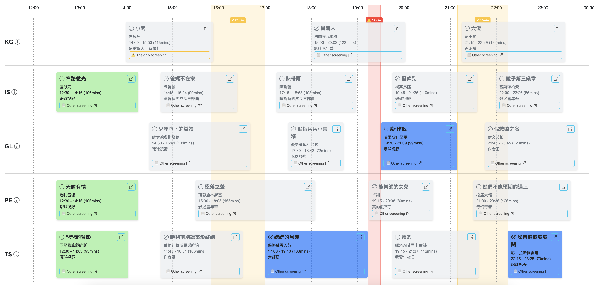

# HKIFF50 Timetable

Film festival screening scheduler with conflict detection and export features.



## Quick Start

```bash
npm install
npm run dev
```

## Build

```bash
npm run build    # Output to dist/
npm run preview  # Preview production build
```

## Project Structure

```
├── index.html
├── src/
│   ├── app.jsx
│   ├── main.jsx
│   ├── components/
│   │   ├── DateNavigator.jsx
│   │   ├── LocationRow.jsx
│   │   ├── ScreeningBlock.jsx
│   │   ├── TimeAxis.jsx
│   │   └── Timetable.jsx
│   ├── data/
│   │   ├── index.js
│   │   └── gathering/
│   │       ├── screenings-en.json
│   │       └── screenings-tc.json
│   └── utils/
│       ├── constants.js
│       ├── dateUtils.js
│       ├── exportUtils.js
│       └── screeningUtils.js
```

## Features

- Visual timeline grid (12pm - midnight)
- Travel time conflict detection
- Auto-save selections to local storage
- CSV and ICS calendar export

## Tech Stack

- React 19 + Vite
- Bootstrap 5.3 + Icons
- dayjs
